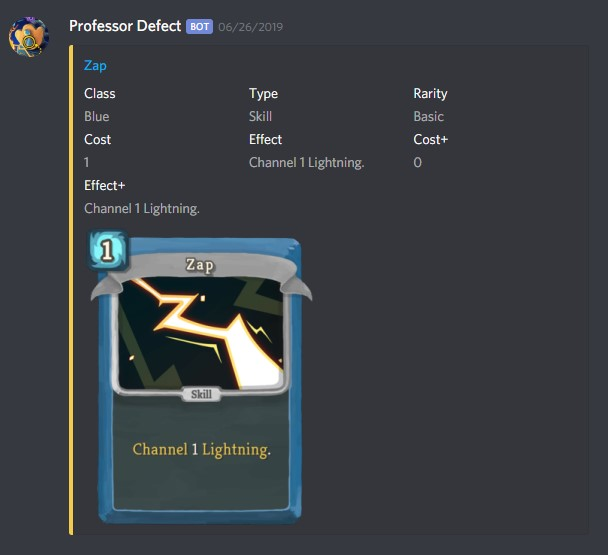

# professor-defect
Slay the Spire Discord bot

### Description
Simple bot built with node.js which responds to card/relic queries. For example: `sts zap`



### Setup
Create your `auth.json` file as per the provided `auth.example.json` file. Then run:
```
yarn
node index.js
```
